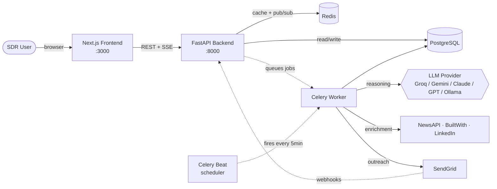
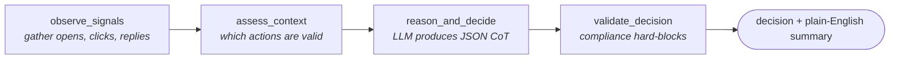

<div align="center">

# 🧠 SalesAgent AI

### Autonomous Reasoning Agent for B2B Sales Outreach

**Capgemini AgentifAI Buildathon 2026 · Use Case #27 · Team MultiBots**

[](https://nextjs.org/)
[](https://fastapi.tiangolo.com/)
[](https://www.python.org/)
[](https://www.postgresql.org/)
[](https://redis.io/)
[](https://www.docker.com/)
[](https://www.langchain.com/langgraph)
[](https://opensource.org/licenses/MIT)

</div>

---

## Why This Is Different

> **Competitors automate volume. SalesAgent AI automates judgement.**

Most sales-outreach tools fire emails on a schedule. SalesAgent AI is a reasoning agent that looks at every signal a lead has produced, decides what to do next, **explains why in plain English**, and gets smarter every week from engagement data.

Every agent decision answers three questions before any action is taken:

1. **What signals did I observe?**
2. **What options did I consider?**
3. **Why did I choose this action and not another?**

That transparency is the product.

---

## Quick Start (3 commands, free LLM)

### Prerequisites

- [Docker Desktop](https://www.docker.com/products/docker-desktop) installed and running
- A free Groq API key (60 seconds to get): [console.groq.com/keys](https://console.groq.com/keys)

### Run it

```bash
# 1. Clone the repo
git clone https://github.com/<your-org>/salesagent-ai.git
cd salesagent-ai

# 2. Copy env template and add your free Groq key
cp .env.example .env
# Open .env and set:
#   LLM_PROVIDER=groq
#   GROQ_API_KEY=gsk_your_key_here

# 3. Build and start the entire stack
docker-compose up --build
```

Once you see `Application startup complete`, in a **new terminal**:

```bash
# Seed the database with demo data (5 scenarios + rising reply-rate trend)
docker-compose exec backend python seed.py
```

Open the app:
- **Dashboard:** http://localhost:3000
- **API docs:** http://localhost:8000/docs

That's it. The agent is running.

---

## Demo Walkthrough (60 seconds)

Open the dashboard and follow this path. Every claim about the product is something you can see on screen.

| # | Where | What to see |
|---|---|---|
| 1 | **Dashboard** | Pipeline of 5 leads with the agent's plain-English reason on every card |
| 2 | **Click Sarah Chen (Acme SaaS)** | Full chain of thought — signal analysis, options considered, final decision with confidence |
| 3 | **Click "Run Agent Reasoning"** | A fresh decision is generated live by the LLM |
| 4 | **Analytics → Reply Rate Trend** | 3.2% → 5.8% → 8.4% → 11.7% over 4 weeks. The self-improving loop, made visible |
| 5 | **Agent Feed** | Full audit log. Every decision the agent ever made, filterable by type and confidence |
| 6 | **Import → upload `backend/demo-leads.csv`** | 15 real B2B companies (Clay, Linear, Vercel, Mercury, Pinecone, etc.) flowing through enrichment in real time |

---

## Architecture

### High-level data flow



### The reasoning agent (LangGraph)

Every lead flows through a 4-node state machine:



The **single most important line** in the codebase, in `backend/app/agent/reasoning_engine.py`:

```python
state["reasoning_summary"] = reasoning_output["reasoning_summary"]
```

That field is what every UI screen surfaces. It's what makes this an agent and not automation.

---

## Tech Stack

| Layer | Technology | Why |
|---|---|---|
| Frontend | Next.js 14 (App Router) + Tailwind + Recharts | Server components, real-time dashboard, enterprise-grade UI |
| Backend | FastAPI · async Python 3.11 | Native async for webhook bursts and concurrent enrichment |
| Agent orchestration | LangGraph + LangChain | Stateful 4-node reasoning graph with audit trail |
| LLM | **Pluggable** — Groq, Gemini, Claude, GPT, or Ollama | Pick by env variable, no code changes |
| Database | PostgreSQL 15 (async via SQLAlchemy 2) | Relational lead data, complex analytics queries |
| Cache / Pub-Sub | Redis 7 | Sub-millisecond live state, SSE event stream |
| Background jobs | Celery + Celery Beat | Async enrichment, scheduled reasoning, A/B winner selection |
| Email delivery | SendGrid (with mock fallback) | Webhook tracking infrastructure |
| Reply intelligence | LLM-based intent + sentiment classifier | Routes objections, unsubscribes, OOO replies correctly |
| Containerisation | Docker Compose | One command to run the entire stack |
| Tests | Pytest (backend) | Unit tests for reasoning engine, spam scorer, CSV parser |

---

## Pluggable LLM Providers

Switch the AI brain by changing **one line** in `.env`. No code changes.

| Provider | Cost | Speed | Setup | Best for |
|---|---|---|---|---|
| **Groq** | Free (Llama 3.3 70B) | Fastest | 1 min | **Recommended for demos** |
| Google Gemini | Free tier (1500/day) | Fast | 2 min | Backup |
| Anthropic Claude | Paid | Fast | 2 min | Best reasoning quality |
| OpenAI GPT-4o-mini | Paid ($5 free trial) | Fast | 2 min | Familiar baseline |
| Ollama (local) | $0, offline | Slow on CPU | 10 min | Zero-dependency local demos |

### How to switch

```env
# .env
LLM_PROVIDER=groq
GROQ_API_KEY=gsk_...
```

| Set this | To use |
|---|---|
| `LLM_PROVIDER=groq` + `GROQ_API_KEY=...` | Groq |
| `LLM_PROVIDER=gemini` + `GEMINI_API_KEY=...` | Gemini |
| `LLM_PROVIDER=anthropic` + `ANTHROPIC_API_KEY=...` | Claude |
| `LLM_PROVIDER=openai` + `OPENAI_API_KEY=...` | GPT |
| `LLM_PROVIDER=ollama` + Ollama on host | Local Llama |

Restart with `docker-compose restart backend celery_worker` to apply.

---

## Project Structure

```
salesagent-ai/
├── backend/
│   ├── app/
│   │   ├── agent/                       # 🧠 The reasoning core
│   │   │   ├── reasoning_engine.py      # LangGraph 4-node agent
│   │   │   ├── decision_maker.py        # Persistence + execution
│   │   │   ├── chain_of_thought.py      # CoT formatting for UI
│   │   │   ├── feedback_loop.py         # Self-improvement loop
│   │   │   └── state_machine.py         # Lead state transitions
│   │   │
│   │   ├── enrichment/                  # Multi-source enrichment
│   │   │   ├── enrichment_agent.py      # Orchestrator with graceful degradation
│   │   │   ├── linkedin_enricher.py
│   │   │   ├── news_enricher.py
│   │   │   ├── techstack_enricher.py
│   │   │   └── intent_enricher.py
│   │   │
│   │   ├── outreach/                    # Email generation + delivery
│   │   │   ├── sequence_generator.py    # LLM-written personalised emails
│   │   │   ├── email_sender.py          # SendGrid integration
│   │   │   ├── compliance.py            # CAN-SPAM / GDPR
│   │   │   └── ab_testing.py
│   │   │
│   │   ├── nlp/                         # Inbound reply intelligence
│   │   │   ├── reply_classifier.py
│   │   │   └── sentiment_analyser.py
│   │   │
│   │   ├── api/                         # FastAPI routes
│   │   │   ├── leads.py
│   │   │   ├── agent.py
│   │   │   ├── sequences.py
│   │   │   ├── webhooks.py
│   │   │   ├── analytics.py
│   │   │   └── auth.py
│   │   │
│   │   ├── tasks/                       # Celery background workers
│   │   │   ├── celery_app.py
│   │   │   ├── enrichment_tasks.py
│   │   │   ├── reasoning_tasks.py
│   │   │   ├── feedback_tasks.py
│   │   │   └── loop_helper.py           # Persistent event loop per worker
│   │   │
│   │   ├── models/                      # SQLAlchemy ORM
│   │   ├── schemas/                     # Pydantic request/response
│   │   ├── utils/                       # CSV parser, spam scorer, OAuth
│   │   ├── llm.py                       # 🔌 LLM provider factory
│   │   ├── config.py                    # Centralised env settings
│   │   ├── database.py                  # Async + sync engine setup
│   │   ├── redis_client.py              # Pub/sub helpers
│   │   └── main.py                      # FastAPI app + SSE endpoint
│   │
│   ├── tests/                           # Pytest unit tests
│   ├── seed.py                          # Demo data populator
│   ├── demo-leads.csv                   # 15 real B2B companies for testing
│   ├── requirements.txt
│   └── Dockerfile
│
├── frontend/
│   ├── app/                             # Next.js 14 App Router
│   │   ├── dashboard/                   # Pipeline + live agent feed
│   │   ├── leads/[id]/                  # Lead detail with full CoT
│   │   ├── analytics/                   # Reply rate, funnel, A/B, agent perf
│   │   ├── agent-feed/                  # Decision audit log
│   │   ├── sequences/
│   │   ├── import/                      # CSV + CRM connect
│   │   └── settings/
│   │
│   ├── components/
│   │   ├── dashboard/                   # PipelineBoard, LeadCard, AgentReasoningPanel, ActivityFeed, MetricsStrip
│   │   ├── leads/                       # LeadTable, LeadEnrichmentView, CSVUploader, StateTimeline
│   │   ├── analytics/                   # All charts (Recharts)
│   │   └── shared/                      # Sidebar, Navbar, StatusBadge
│   │
│   ├── lib/
│   │   ├── api.ts                       # Typed API client
│   │   ├── types.ts                     # Shared TypeScript types
│   │   └── utils.ts                     # State/decision color maps, formatters
│   │
│   ├── package.json
│   └── Dockerfile
│
├── docker-compose.yml                   # Full local stack
├── docker-compose.prod.yml              # Production overrides
├── .env.example                         # All env vars documented
└── README.md
```

---

## Database Schema

8 tables. Most important highlighted.

| Table | Purpose |
|---|---|
| `leads` | Lead profile + state machine + enrichment data |
| `companies` | Company-level enrichment, ICP fit, intent score |
| `sequences` + `sequence_steps` | Multi-touch outreach templates |
| `email_events` | Every send/open/click/reply tracked via SendGrid |
| **`agent_decisions`** | **🧠 The product. Reasoning summary + full chain of thought, persisted forever** |
| `ab_tests` | Variant performance per sequence step |
| `prompt_strategies` | Self-improving reply-rate metrics per (vertical, seniority, hook type) |

---

## Key API Endpoints

Full interactive docs at http://localhost:8000/docs after startup.

### Leads
```http
POST   /api/leads/import/csv       # Upload CSV, auto-enrich
GET    /api/leads                  # List with filters + pagination
GET    /api/leads/{id}             # Full lead detail
POST   /api/leads/{id}/enrich      # Trigger enrichment manually
DELETE /api/leads/{id}             # Soft delete + opt-out
```

### Agent
```http
POST   /api/agent/decide/{lead_id}            # Run reasoning live for one lead
POST   /api/agent/decide/batch                # Run reasoning for all due leads
GET    /api/agent/decisions                   # Audit log with filters
GET    /api/agent/reasoning/{lead_id}         # Full CoT history for a lead
POST   /api/agent/decisions/{id}/approve      # Human approves
POST   /api/agent/decisions/{id}/override     # Human overrides
```

### Webhooks
```http
POST   /api/webhooks/sendgrid      # Receive email tracking events
POST   /api/webhooks/reply         # Receive inbound reply for classification
```

### Analytics
```http
GET    /api/analytics/overview              # Top-of-page KPIs
GET    /api/analytics/reply-rate            # Weekly trend
GET    /api/analytics/funnel                # Send → Open → Click → Reply
GET    /api/analytics/agent-performance     # Decision breakdown + confidence trend
```

### Real-time
```http
GET    /api/stream/activity        # Server-Sent Events stream of agent activity
```

---

## Compliance & Safety

- ✅ Every email passes a **spam-score check** before send (threshold 3.0)
- ✅ **Unsubscribe footer** auto-injected into every email per CAN-SPAM
- ✅ **One-click unsubscribe** at `/unsubscribe/{lead_id}`
- ✅ **Opt-out hard block** — agent cannot send to opted-out leads regardless of decision
- ✅ **Human-in-the-loop default** — decisions with confidence < 65% escalate automatically
- ✅ **Mock email mode** when SendGrid key is missing (no accidental sends in dev)
- ✅ **Graceful enrichment degradation** — missing API keys reduce score, never block flow

---

## Testing

```bash
# Run backend unit tests (no LLM calls — uses fakes)
docker-compose exec backend pytest tests/ -v

# Test specific module
docker-compose exec backend pytest tests/test_reasoning_engine.py -v
```

Test coverage focuses on critical paths:
- Reasoning engine state machine (signal observation, action assessment, validation hard-blocks)
- Spam scorer thresholds
- CSV parser edge cases (BOM, header normalisation, validation)

---

## Configuration Reference

All in `.env` (see `.env.example` for the full template).

### Required
```env
LLM_PROVIDER=groq
GROQ_API_KEY=gsk_...
```

### Optional (graceful fallback if missing)
```env
NEWS_API_KEY=                # Real company news → enrichment_score boost
BUILTWITH_API_KEY=           # Real tech stacks → buying intent signals
SENDGRID_API_KEY=            # Real email delivery → mock mode if absent
```

### Agent behaviour
```env
AUTOPILOT_MODE=false         # true = agent acts without approval
CONFIDENCE_THRESHOLD=0.65    # Below this, escalate to human
```

---

## Common Operations

### Reset demo data
```bash
docker-compose exec backend python seed.py
```

### Stop the stack
```bash
# Press Ctrl+C in the terminal running docker-compose, or:
docker-compose down
```

### Full clean wipe (including database volume)
```bash
docker-compose down -v
docker-compose up --build
```

### View logs from a single service
```bash
docker-compose logs -f backend
docker-compose logs -f celery_worker
```

### Rebuild after dependency changes
```bash
docker-compose up --build
```

---

## What Winning Looks Like

When an evaluator opens this project, within 60 seconds they should see:

1. ✅ **A live dashboard** with leads in a pipeline and agent decisions populating the live feed
2. ✅ **Plain-English reasoning** on every lead card and in the live activity stream
3. ✅ **An analytics chart** showing reply rate climbing 3.2% → 11.7% over 4 weeks
4. ✅ **One lead detail page** with the complete chain of thought (signal analysis → options → decision with confidence)

If those four things are visible, the project has shipped its core promise.

---

## Team MultiBots

| Role | Member |
|---|---|
| AI Architecture | Taranpreet Kaur |
| Backend & Pipeline | Prajyant Veer Siag |
| LLM & Prompt Engineering | Kashish Sood |
| Frontend & UX | Sparsh Nautiyal |
| Business Strategy & QA | Vibhor Jindal |

---

## Acknowledgements

- **Capgemini AgentifAI Buildathon 2026** — Use Case #27 · B2B Sales Outreach Intelligence
- Built with [LangGraph](https://www.langchain.com/langgraph) for stateful agent orchestration
- LLM-agnostic via [LangChain](https://www.langchain.com/) chat model abstractions
- UI inspired by modern operator-first dashboards (Linear, Vercel, Stripe)

---

## License

MIT — see [LICENSE](LICENSE) for details.

---

<div align="center">

**The single most important line in the entire codebase:**

```python
state["reasoning_summary"] = reasoning_output["reasoning_summary"]
```

That's what makes this an agent, not automation.

</div>
