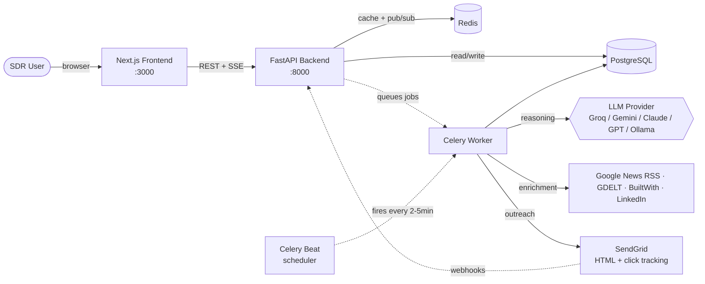
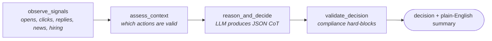

<div align="center">

# 🧠 SalesAgent AI

### Autonomous Reasoning Agent for B2B Sales Outreach

**Capgemini AgentifAI Buildathon 2026 · Use Case #27 · Team MultiBots**

[](https://nextjs.org/)
[](https://fastapi.tiangolo.com/)
[](https://www.python.org/)
[](https://www.postgresql.org/)
[](https://redis.io/)
[](https://www.docker.com/)
[](https://www.langchain.com/langgraph)
[](https://opensource.org/licenses/MIT)

</div>

---

## Why This Is Different

> **Competitors automate volume. SalesAgent AI automates judgement.**

Most sales-outreach tools fire emails on a schedule. SalesAgent AI is a reasoning agent that looks at every signal a lead has produced — including what the buyer is actually doing with prior outreach — decides what to do next, **explains why in plain English**, and gets smarter every week from engagement data.

Every agent decision answers three questions before any action is taken:

1. **What signals did I observe?** — including the buyer's opens, clicks, and reply sentiment
2. **What options did I consider?**
3. **Why did I choose this action and not another?**

That transparency is the product.

### What's in the box

- 🧠 **LangGraph reasoning agent** with a chain-of-thought audit trail on every decision
- 📈 **Three explainable scores** per lead — ICP Fit, Buying Intent, Enrichment Score — each with a hover tooltip showing the exact formula
- 📬 **Buyer-side mail timeline** — opens, clicks, replies (sentiment + intent classified), bounces, unsubscribes
- ✉️ **Per-lead personalised emails** generated by the LLM at runtime, never template substitution
- 🖱️ **Click + open tracking** baked in — emails go out as HTML with SendGrid `tracking_settings`, so the dashboard reflects what the buyer actually does
- ✅ **One-click Approve that actually sends** — the agent's recommendation runs end-to-end, with idempotency and compliance hard-blocks
- 🎤 **Demo recipient override** — flip a switch in the navbar and every Compose / Approve / Sequence Send goes to your inbox during the pitch
- 📰 **Inject demo news live** — drop a Series-B / hiring / competitor-tool headline on stage and watch all three scores recompute in real time
- 🔁 **Sequences that actually run** — once a lead is enrolled, the agent advances them through every step automatically, with an "Run progression now" button for the demo
- 🚀 **One-click Demo Leads loader** — bootstraps 15 richly-enriched leads from the dashboard, no terminal scripts
- 🔍 **Live navbar search** across leads + a real-time **notifications bell** powered by Redis pub/sub
- 🔌 **Pluggable LLM** — Groq, Gemini, Claude, GPT, or local Ollama via one env var
- 🆓 **Open-source enrichment** — news enrichment works with zero API keys via Google News RSS + GDELT
- ⚙️ **Compliance built-in** — opt-out hard blocks, spam scoring, CAN-SPAM unsubscribe footer, UUID-validated unsubscribe links

---

## Quick Start

### Prerequisites

- [Docker Desktop](https://www.docker.com/products/docker-desktop) installed and running
- A free Groq API key (60 seconds to get): [console.groq.com/keys](https://console.groq.com/keys)

### Run it

```bash
# 1. Clone the repo
git clone https://github.com/Prajyant/Capgemini.git
cd Capgemini

# 2. Copy env template and add your free Groq key
cp .env.example .env
# Open .env and set:
#   LLM_PROVIDER=groq
#   GROQ_API_KEY=gsk_your_key_here

# 3. Build and start the entire stack
docker compose up --build
```

Open the app once you see `Application startup complete`:

- **Dashboard:** http://localhost:3000
- **API docs:** http://localhost:8000/docs

To bootstrap demo data, click **Import → Demo Leads tab → Load Demo Leads**. No CLI scripts required.

---

## Demo Walkthrough (90 seconds)

| # | Where | What to show |
|---|---|---|
| 1 | **Navbar → Demo recipient** | Drop your own email in. Every send for the rest of the pitch will land in your inbox while still appearing in the lead's timeline as if sent to them. |
| 2 | **Import → Demo Leads → Load Demo Leads** | One click seeds 15 richly-enriched B2B leads (Clay, Linear, Hex, Pinecone, Ramp, etc.) with funding news, hiring signals, tech stacks. |
| 3 | **Dashboard** | Pipeline columns populate with the agent's plain-English reason on every lead card. Live activity feed on the right. |
| 4 | **Click any lead** | Three scores side-by-side — ICP Fit, Buying Intent, Enrichment. Hover the `?` next to each to see the formula. |
| 5 | **Add demo news → "Just raised Series B"** | Watch the buying intent score jump (+30 funding bonus) and enrichment score climb (+8 news) on screen. |
| 6 | **Run Agent Reasoning** | Live LLM call produces a fresh decision with signal analysis, options considered, and confidence — now reflecting the news. |
| 7 | **Approve** on the chain-of-thought card | The email is drafted by the LLM and sent (to your demo inbox). The new "sent" event appears in Prior Engagement immediately. |
| 8 | **Simulate buyer reply** | An inbound reply is classified into sentiment + intent, intent score refreshes, lead state moves to `replied`, agent reasons about the reply. |
| 9 | **Sequences → New Sequence → Preview emails** | Pick a lead and the agent generates three personalised emails (intro / follow-up / breakup) using that lead's enrichment context. |
| 10 | **Run progression now** | Skip the 2-minute beat — the auto-progression task fires and step 2 of the sequence generates and sends on the spot. |
| 11 | **Analytics** | Reply rate trend, funnel, channel performance, A/B winners, agent confidence over time. The self-improving loop made visible. |
| 12 | **Agent Feed** | Full audit log. Every decision the agent ever made, with lead name + company on every card, filterable by type and confidence. |

---

## Architecture

### High-level data flow



### The reasoning agent (LangGraph)

Every lead flows through a 4-node state machine:



The **single most important line** in the codebase, in `backend/app/agent/reasoning_engine.py`:

```python
state["reasoning_summary"] = reasoning_output["reasoning_summary"]
```

That field is what every UI screen surfaces. It's what makes this an agent and not automation.

### Three explainable scores per lead

Hover the `?` next to any score in the UI to see the exact formula. They're computed locally — no opaque ML — so you can defend every number on stage.

#### ICP Fit Score (`enrichment_agent.py::_compute_icp_fit`)

| Component | Contribution |
|---|---|
| Baseline | 50 |
| 50–500 employees | +20 |
| Industry contains `saas` / `software` / `tech` | +15 |
| Funding stage Series A/B/C | +10 |
| Seniority is VP / C-Level / Director / Founder | +5 |

#### Buying Intent Score (`intent_enricher.py::derive_intent_signals`)

Five buckets, summed and capped at 100. Every point lands with a sentence in the lead's `reasons` list.

| Bucket | Cap | Driven by |
|---|---|---|
| Recent funding / IPO | 30 | News headlines, recency-weighted (≤90 days = full points) |
| Hiring activity | 25 | Number of hiring mentions in news |
| Tech replacement | 30 | Competitor tooling already in their stack (Outreach, Salesloft, Apollo, ZoomInfo, etc.) |
| Senior decision-maker | 10 | C-Level / VP / Director / Founder seniority |
| **Buyer engagement** | **35** | **Replies, sentiment, intent, clicks, opens — the strongest signal there is** |

The score recomputes automatically every time the buyer engages. SendGrid webhooks (open/click/bounce) and inbound replies both refresh intent, and adding a news item via the **Add demo news** button does the same — live, on stage.

#### Enrichment Score (`enrichment_agent.py::_compute_enrichment_score`)

A data-richness indicator (how much do we actually know about this lead?), not a quality score.

| Bucket | Contribution |
|---|---|
| LinkedIn signals present | +20 |
| News items | +8 each, capped at 30 |
| Tech stack items | +2 each, capped at 30 |
| Buying intent fires | +20 |

### Buyer-side mail timeline

Every send, open, click, reply, bounce, and unsubscribe is captured in the `email_events` table and rendered in the **Prior Engagement** panel. Replies are LLM-classified into sentiment + intent (`interested`, `not_now`, `meeting_requested`, `unsubscribe`, etc.) and feed back into reasoning for the next decision.

Outbound emails go out as **HTML with explicit click + open tracking enabled** (`tracking_settings.click_tracking.enable=True`, `enable_text=True`). URLs in the body are auto-linkified before send so SendGrid can rewrite them into tracked redirects — that's why click events actually populate the dashboard.

For demo and testing, **Simulate buyer reply** POSTs to `/api/webhooks/reply` with whatever text you type — useful for showing the agent reacting to a real reply without configuring an inbound mailbox.

### Sequences that actually run

A sequence is a multi-touch outreach plan — an ordered list of steps (channel, wait days, optional subject hint). The actual subject and body of every email are generated per-lead at runtime from their enrichment context, so no two leads ever get the same copy.

Once a lead is enrolled (via Preview emails → Send step 1, or `POST /api/sequences/{id}/enroll/{lead_id}`), the **`progress_sequences`** Celery task runs every 2 minutes and:

1. Finds enrolled leads with a passed `next_action_at`, skipping terminal states (`replied`, `converted`, `closed`, `unsubscribed`)
2. Generates the next step's email via the LLM (intro / follow-up / breakup based on step number)
3. Records an `AgentDecision` so it shows up in the live feed with the lead's company name
4. In autopilot mode (`AUTOPILOT_MODE=true`): sends and bumps `current_step` + schedules the next step
5. In supervised mode: leaves the decision pending for human approval

For demos, the **Run progression now** button on the Sequences page triggers the task immediately rather than waiting for the next beat.

---

## Live Demo Tools

Three features designed specifically for live presentations:

### Demo recipient override (navbar)
Flip a switch in the navbar and every Compose / Approve / Sequence Step send is delivered to your address instead of the lead's real email. The lead's timeline still records the event normally so the dashboard, intent score, and reasoning trail look exactly like a real send. Persisted in `localStorage`, applied transparently by the API client.

### Inject demo news (lead detail page)
Three quick-template buttons mapped to the actual keyword buckets the intent enricher scans for:

- *Just raised Series B* → matches `raises` / `series` → +30 funding intent
- *Hiring a sales team* → matches `hiring` / `expanding team` → up to +25 hiring
- *Adopted competitor tool* → mentions `Outreach.io` → +10 tech replacement

Custom headlines work too. Saving recomputes both the buying-intent score and the enrichment score, then refreshes the page.

### One-click Demo Leads loader (Import tab)
Replaces the old `demo_send.py` terminal flow. Click **Import → Demo Leads → Load Demo Leads** and 15 richly-enriched leads land in `enriched` state, each with realistic news, tech stacks, hiring signals, and LinkedIn behaviour for the agent to reason over.

---

## Tech Stack

| Layer | Technology | Why |
|---|---|---|
| Frontend | Next.js 14 (App Router, Turbopack) + Tailwind + Recharts | Server components, real-time dashboard, fast HMR |
| Backend | FastAPI · async Python 3.11 | Native async for webhook bursts and concurrent enrichment |
| Agent orchestration | LangGraph + LangChain | Stateful 4-node reasoning graph with audit trail |
| LLM | **Pluggable** — Groq, Gemini, Claude, GPT, or Ollama | Pick by env variable, no code changes |
| Database | PostgreSQL 15 (async via SQLAlchemy 2) | Relational lead data, complex analytics queries |
| Cache / Pub-Sub | Redis 7 | Sub-millisecond live state, SSE event stream |
| Background jobs | Celery + Celery Beat | Async enrichment, scheduled reasoning, sequence progression, A/B winner selection |
| Email delivery | SendGrid (HTML + click tracking, mock fallback) | Webhook tracking infrastructure |
| Reply intelligence | LLM-based intent + sentiment classifier | Routes objections, unsubscribes, OOO replies correctly |
| Containerisation | Docker Compose | One command to run the entire stack |
| Tests | Pytest (backend) | Unit tests for reasoning engine, spam scorer, CSV parser |

---

## Pluggable LLM Providers

Switch the AI brain by changing **one line** in `.env`. No code changes.

| Provider | Cost | Speed | Setup | Best for |
|---|---|---|---|---|
| **Groq** | Free (Llama 3.3 70B, 100k tokens/day) | Fastest | 1 min | **Recommended for demos** |
| Google Gemini | Free tier (1500/day) | Fast | 2 min | Backup when Groq hits rate limit |
| Anthropic Claude | Paid | Fast | 2 min | Best reasoning quality |
| OpenAI GPT-4o-mini | Paid ($5 free trial) | Fast | 2 min | Familiar baseline |
| Ollama (local) | $0, offline | Slow on CPU | 10 min | Zero-dependency local demos |

```env
# .env
LLM_PROVIDER=groq
GROQ_API_KEY=gsk_...
```

| Set this | To use |
|---|---|
| `LLM_PROVIDER=groq` + `GROQ_API_KEY=...` | Groq |
| `LLM_PROVIDER=gemini` + `GEMINI_API_KEY=...` | Gemini |
| `LLM_PROVIDER=anthropic` + `ANTHROPIC_API_KEY=...` | Claude |
| `LLM_PROVIDER=openai` + `OPENAI_API_KEY=...` | GPT |
| `LLM_PROVIDER=ollama` + Ollama on host | Local Llama |

Restart with `docker compose restart backend celery_worker` to apply.

---

## Performance Notes

This stack hosts five concurrent polling loops on the dashboard alone, plus an SSE stream and the reasoning agent. A few decisions keep the UI snappy on a hackathon laptop:

- **Analytics endpoints use grouped SQL** — `/overview` is 3 grouped queries instead of 8 sequential `COUNT(*)`, `/reply-rate` is 1 query + Python bucketing instead of 16, `/agent-performance` is 4 grouped queries instead of 17+.
- **Lead listing skips heavy relationships** — `list_leads` uses `noload(Lead.email_events)` and `noload(Lead.agent_decisions)` so the dashboard's 100-lead query doesn't drag in every email event and decision for every lead.
- **Decision cards include lead name + company server-side** — populated via `selectinload(AgentDecision.lead).selectinload(Lead.company)` in a single round-trip, no N+1.
- **Polling intervals are slow safety nets** — SSE drives live updates; polling kicks in at 30–60s as a backup, not the primary path.
- **Frontend uses Turbopack** — `next dev --turbo` for dramatically faster on-demand compilation than webpack.

---

## Project Structure

```
Capgemini/
├── backend/
│   ├── app/
│   │   ├── agent/                       # 🧠 The reasoning core
│   │   │   ├── reasoning_engine.py      # LangGraph 4-node agent
│   │   │   ├── decision_maker.py        # Persistence + execution
│   │   │   ├── chain_of_thought.py
│   │   │   ├── feedback_loop.py
│   │   │   └── state_machine.py
│   │   │
│   │   ├── enrichment/                  # Multi-source enrichment
│   │   │   ├── enrichment_agent.py      # Orchestrator + ICP/enrichment scoring
│   │   │   ├── intent_enricher.py       # Buying intent calculator
│   │   │   ├── linkedin_enricher.py
│   │   │   ├── news_enricher.py
│   │   │   └── techstack_enricher.py
│   │   │
│   │   ├── outreach/                    # Email generation + delivery
│   │   │   ├── sequence_generator.py    # LLM-written personalised emails
│   │   │   ├── email_sender.py          # SendGrid (HTML + click tracking)
│   │   │   ├── compliance.py            # CAN-SPAM, plain-text → HTML, linkifier
│   │   │   └── ab_testing.py
│   │   │
│   │   ├── nlp/                         # Inbound reply intelligence
│   │   │
│   │   ├── api/                         # FastAPI routes
│   │   │   ├── leads.py                 # CRUD + CSV import + seed-demo + news injection
│   │   │   ├── agent.py                 # Reasoning + decisions + Approve/Override
│   │   │   ├── sequences.py             # List + create + per-lead preview + auto-progression
│   │   │   ├── webhooks.py              # SendGrid + inbound reply
│   │   │   ├── analytics.py             # Grouped queries for fast dashboard
│   │   │   ├── settings.py
│   │   │   └── auth.py
│   │   │
│   │   ├── tasks/                       # Celery background workers
│   │   │   ├── celery_app.py            # Beat schedule
│   │   │   ├── enrichment_tasks.py
│   │   │   ├── reasoning_tasks.py       # process_due_leads (every 5 min)
│   │   │   ├── sequence_tasks.py        # progress_sequences (every 2 min)
│   │   │   ├── feedback_tasks.py        # AB winners + inbox polling
│   │   │   └── loop_helper.py
│   │   │
│   │   ├── inbox/                       # IMAP reply reader (optional)
│   │   ├── models/                      # SQLAlchemy ORM
│   │   ├── schemas/                     # Pydantic with lead_name/company helpers
│   │   ├── utils/
│   │   │   ├── demo_data.py             # 15 hardcoded demo leads
│   │   │   ├── csv_parser.py
│   │   │   └── spam_scorer.py
│   │   ├── llm.py                       # 🔌 LLM provider factory + mock
│   │   ├── config.py
│   │   ├── database.py
│   │   ├── redis_client.py
│   │   └── main.py                      # FastAPI app + SSE + UUID-validated unsubscribe
│   │
│   ├── tests/                           # Pytest unit tests
│   ├── demo-leads.csv                   # CSV mirror of the demo dataset
│   ├── demo_send.py                     # Legacy CLI sender (UI replaces it)
│   ├── requirements.txt
│   └── Dockerfile
│
├── frontend/
│   ├── app/                             # Next.js 14 App Router
│   │   ├── dashboard/
│   │   ├── leads/[id]/                  # Lead detail with full CoT + Approve
│   │   ├── analytics/
│   │   ├── agent-feed/                  # Decision audit log with lead name + company
│   │   ├── sequences/                   # With "Run progression now" button
│   │   ├── import/                      # CSV + Demo Leads + CRM connect
│   │   └── settings/
│   │
│   ├── components/
│   │   ├── dashboard/                   # PipelineBoard, AgentReasoningPanel, ActivityFeed, MetricsStrip, LeadCard
│   │   ├── leads/                       # LeadTable, LeadEnrichmentView (with score tooltips), LeadEngagementPanel,
│   │   │                                # CSVUploader, DemoSeedPanel, NewsInjector, EmailComposer, LeadStateTimeline
│   │   ├── analytics/                   # All charts (Recharts)
│   │   └── shared/                      # Sidebar, Navbar (search + notifications + DemoRecipientWidget), StatusBadge
│   │
│   ├── lib/
│   │   ├── api.ts                       # Typed API client with transparent demo-recipient injection
│   │   ├── demoMode.ts                  # localStorage-backed demo recipient override
│   │   ├── types.ts
│   │   └── utils.ts
│   │
│   ├── package.json
│   └── Dockerfile
│
├── docker-compose.yml
├── docker-compose.prod.yml
├── .env.example
└── README.md
```

---

## Database Schema

8 tables. Most important highlighted.

| Table | Purpose |
|---|---|
| `leads` | Lead profile + state machine + enrichment data |
| `companies` | Company-level enrichment, ICP fit, intent score |
| `sequences` + `sequence_steps` | Multi-touch outreach templates |
| `email_events` | Every send/open/click/reply tracked via SendGrid |
| **`agent_decisions`** | **🧠 The product. Reasoning summary + full chain of thought, persisted forever** |
| `ab_tests` | Variant performance per sequence step |
| `prompt_strategies` | Self-improving reply-rate metrics per (vertical, seniority, hook type) |

---

## Key API Endpoints

Full interactive docs at http://localhost:8000/docs after startup.

### Leads
```http
POST   /api/leads/import/csv             # Upload CSV, auto-enrich
POST   /api/leads/seed-demo              # 🆕 One-click bootstrap of 15 enriched demo leads
GET    /api/leads                        # List with state/search filters + pagination
GET    /api/leads/{id}                   # Full lead detail
GET    /api/leads/{id}/events            # Buyer-side engagement timeline
POST   /api/leads/{id}/enrich            # Trigger enrichment manually
POST   /api/leads/{id}/news              # 🆕 Inject a news item, scores recompute live
DELETE /api/leads/{id}/news/{index}      # 🆕 Remove a news item, scores recompute live
DELETE /api/leads/{id}                   # Soft delete + opt-out
```

### Sequences
```http
GET    /api/sequences                                  # List active sequences
POST   /api/sequences                                  # Create with custom steps
GET    /api/sequences/{id}/emails/{lead_id}            # Generate the 3 personalised emails for this lead
POST   /api/sequences/send-step/{lead_id}              # Send one step + schedule the next via next_action_at
POST   /api/sequences/{id}/enroll/{lead_id}            # 🆕 Enrol a lead so auto-progression picks them up
POST   /api/sequences/progress/run-now                 # 🆕 Trigger sequence auto-progression on demand
```

### Agent
```http
POST   /api/agent/decide/{lead_id}                     # Run reasoning live for one lead
POST   /api/agent/decide/batch                         # Run reasoning for all due leads
GET    /api/agent/decisions                            # Audit log with filters (now includes lead_name + company)
GET    /api/agent/reasoning/{lead_id}                  # Full CoT history for a lead
POST   /api/agent/decisions/{id}/approve               # 🆕 Now actually executes the decision (sends email, etc.)
POST   /api/agent/decisions/{id}/override              # Human overrides
POST   /api/agent/draft-email/{lead_id}                # Draft a personalised email (intro for fresh, reply for threads)
POST   /api/agent/send-email/{lead_id}                 # Send a (possibly edited) email — accepts `to_email` override
```

### Webhooks
```http
POST   /api/webhooks/sendgrid      # Receive email tracking events (refreshes intent)
POST   /api/webhooks/reply         # Receive inbound reply, classify, refresh intent, trigger reasoning
```

### Analytics
```http
GET    /api/analytics/overview              # Top-of-page KPIs (3 grouped queries)
GET    /api/analytics/reply-rate            # Weekly trend (1 query + Python bucketing)
GET    /api/analytics/funnel                # Send → Open → Click → Reply (1 GROUP BY)
GET    /api/analytics/channels              # Channel performance (1 GROUP BY w/ FILTER)
GET    /api/analytics/agent-performance     # Decision breakdown + confidence trend (4 grouped queries)
GET    /api/analytics/activity-feed         # Redis-backed live feed (powers the bell)
```

### Real-time
```http
GET    /api/stream/activity        # Server-Sent Events stream of agent activity
```

---

## Compliance & Safety

- ✅ Every email passes a **spam-score check** before send (threshold 3.0)
- ✅ **Unsubscribe footer** auto-injected into every email per CAN-SPAM
- ✅ **One-click unsubscribe** at `/unsubscribe/{lead_id}` with **UUID validation** (malformed links return 400 instead of crashing)
- ✅ **Opt-out hard block** — agent cannot send to opted-out leads regardless of decision
- ✅ **Approve idempotency** — re-clicking Approve never sends a duplicate email
- ✅ **Compliance rollback** — if Approve hits a compliance block at send time, the approval flag is reverted and the user gets a clear error
- ✅ **Human-in-the-loop default** — decisions with confidence < 65% escalate automatically
- ✅ **Mock email mode** when SendGrid key is missing (no accidental sends in dev)
- ✅ **Graceful enrichment degradation** — missing API keys reduce score, never block flow
- ✅ **Inbox poll only when configured** — doesn't spam logs every minute when IMAP creds aren't set

---

## Testing

```bash
# Run backend unit tests (no LLM calls — uses fakes)
docker compose exec backend pytest tests/ -v

# Test specific module
docker compose exec backend pytest tests/test_reasoning_engine.py -v
```

Test coverage focuses on critical paths:
- Reasoning engine state machine (signal observation, action assessment, validation hard-blocks)
- Spam scorer thresholds
- CSV parser edge cases (BOM, header normalisation, validation)

---

## Configuration Reference

All in `.env` (see `.env.example` for the full template).

### Required
```env
LLM_PROVIDER=groq
GROQ_API_KEY=gsk_...
```

### Optional (graceful fallback if missing)
```env
NEWS_API_KEY=                # Optional — news works without a key via Google News RSS + GDELT
BUILTWITH_API_KEY=           # Real tech stacks → buying intent signals
SENDGRID_API_KEY=            # Real email delivery → mock mode if absent
SENDGRID_FROM_EMAIL=         # Sender identity used in From header
SENDGRID_FROM_NAME=
IMAP_HOST=                   # Inbox poll only runs when these are set
IMAP_USER=
IMAP_PASSWORD=
```

### Agent behaviour
```env
AUTOPILOT_MODE=false         # true = agent acts without approval, including auto-sending sequence steps
CONFIDENCE_THRESHOLD=0.65    # Below this, escalate to human
```

---

## Common Operations

### Bootstrap demo data
**Click Import → Demo Leads → Load Demo Leads** in the UI. Replaces the old `python demo_send.py` flow.

### Stop the stack
```bash
docker compose down
```

### Full clean wipe (including database volume)
```bash
docker compose down -v
docker compose up --build
```

### View logs from a single service
```bash
docker compose logs -f backend
docker compose logs -f celery_worker
```

### Rebuild after dependency changes
```bash
docker compose up --build
```

### Trigger sequence progression on demand
**Sequences page → Run progression now** — or `POST /api/sequences/progress/run-now`.

---

## What Winning Looks Like

When an evaluator opens this project, within 90 seconds they should see:

1. ✅ **A live dashboard** with leads in a pipeline and agent decisions populating the live feed, every card naming the lead and their company
2. ✅ **Plain-English reasoning** on every lead card and in the live activity stream
3. ✅ **Three explainable scores** — ICP Fit, Buying Intent, Enrichment — with hover tooltips showing the formula
4. ✅ **Live score changes** — drop a "Series B" demo news headline and watch buying intent jump
5. ✅ **One-click Approve that sends** — the agent's recommendation runs end-to-end, into your demo inbox
6. ✅ **A simulated buyer reply** that updates state, refreshes the intent score, and triggers fresh reasoning live
7. ✅ **Sequence email preview** generating three different personalised emails for the same lead
8. ✅ **Sequence auto-progression** — step 2 generates and sends the moment you hit "Run progression now"

If those eight things are visible, the project has shipped its core promise.

---

## Team MultiBots

| Role | Member |
|---|---|
| AI Architecture | Taranpreet Kaur |
| Backend & Pipeline | Prajyant Veer Siag |
| LLM & Prompt Engineering | Kashish Sood |
| Frontend & UX | Sparsh Nautiyal |
| Business Strategy & QA | Vibhor Jindal |

---

## Acknowledgements

- **Capgemini AgentifAI Buildathon 2026** — Use Case #27 · B2B Sales Outreach Intelligence
- Built with [LangGraph](https://www.langchain.com/langgraph) for stateful agent orchestration
- LLM-agnostic via [LangChain](https://www.langchain.com/) chat model abstractions
- UI inspired by modern operator-first dashboards (Linear, Vercel, Stripe)

---

## License

MIT — see [LICENSE](LICENSE) for details.

---

<div align="center">

**The single most important line in the entire codebase:**

```python
state["reasoning_summary"] = reasoning_output["reasoning_summary"]
```

That's what makes this an agent, not automation.

</div>
